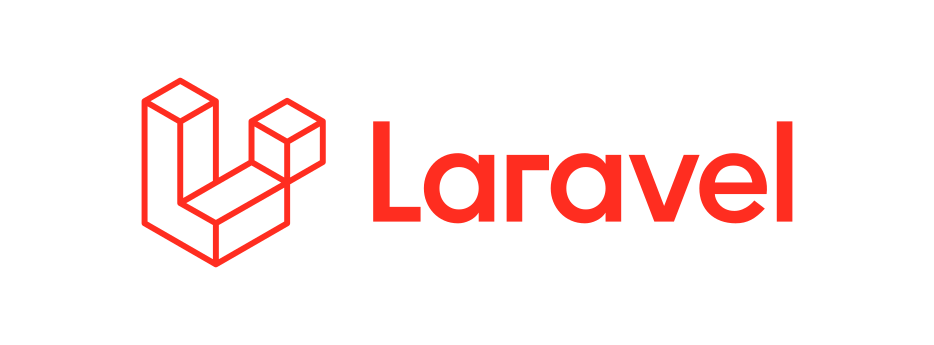

<p align="center">


<br><b>Laravel Highlight.io</b>
</p>
<p align="center">
<a href="https://github.com/tojoo-dev/laravel-highlight/actions"></a>
<a href="https://packagist.org/packages/tojoo-dev/laravel-highlight"></a>
<a href="https://packagist.org/packages/tojoo-dev/laravel-highlight"></a>
<a href="https://packagist.org/packages/tojoo-dev/laravel-highlight"></a>
</p>

Wrapper package for [highlight.io](https://github.com/highlight-io/highlight.php) SDK for Laravel.

> [!NOTE]
> This package requires PHP 8.2+ and Laravel 11+

## Installation

You can install the package via composer:

```
composer require tojoo-dev/laravel-highlight
```

## Usage

WIP
